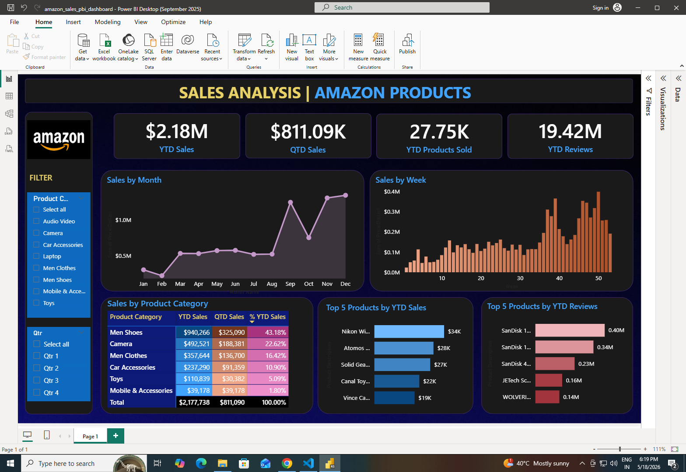

# Amazon Sales Analytics Dashboard 📊

## Project Overview
Designed and developed an interactive **Power BI dashboard** for Amazon Sales Analytics, enabling real-time business intelligence reporting and consolidated visibility across multiple product categories.

The project focuses on transforming raw e-commerce sales, shipment, and customer review data into actionable business insights using Power BI, DAX, Power Query, and data visualization techniques.

---

## Dashboard Preview

---

## Project Highlights
- Designed and developed an interactive **Power BI dashboard** for Amazon Sales Analytics, enabling real-time business intelligence reporting and consolidated visibility across multiple product categories.
- Performed **data integration, data modelling, and ETL transformation** by combining **3 heterogeneous datasets** (Sales, Shipment, and Customer Reviews) into a centralized analytical model using **Power Query, DAX, and Excel** data sources.
- Engineered **10+ advanced DAX measures and KPIs** to track:
  - YTD Sales
  - QTD Sales
  - Revenue Growth
  - Shipment Efficiency
  - Customer Sentiment Analysis
  - Profitability
  - Category Performance
- Conducted **Exploratory Data Analysis (EDA)** and identified:
  - **Men's Shoes** as the top revenue contributor (**43.18% of total sales**)
  - Strong **Q4 seasonal sales spike**
  - Reduced manual reporting effort by approximately **60%**

---

## Key Features
- Interactive Power BI Dashboard
- Real-Time Business Intelligence Reporting
- Dynamic KPI Tracking
- Sales Trend Analysis
- Product Category Performance Analysis
- Shipment Analytics
- Customer Review Insights
- DAX-Based Calculations
- ETL Data Transformation
- Advanced Data Modelling

---

## KPI Metrics

| KPI | Value |
|---|---|
| YTD Sales | $2.18M |
| QTD Sales | $811.09K |
| YTD Products Sold | 27.75K |
| YTD Reviews | 19.42M |
| Top Category | Men's Shoes |
| Highest Revenue Contribution | 43.18% |

---

## Dashboard Components

### 1. KPI Cards
Tracks:
- YTD Sales
- QTD Sales
- Products Sold
- Customer Reviews

### 2. Monthly Sales Trend
Analyzes monthly sales fluctuations and revenue growth patterns.

### 3. Weekly Sales Analysis
Tracks weekly revenue trends and seasonal demand spikes.

### 4. Product Category Analysis
Compares category-wise sales contribution and profitability.

### 5. Top Products by Sales
Highlights best-performing products based on YTD sales.

### 6. Top Products by Reviews
Analyzes customer engagement and review volume.

### 7. Interactive Filters
Enables dynamic filtering based on:
- Product Category
- Quarter (Q1–Q4)

---

## Tools & Technologies Used
- Power BI
- Power Query
- DAX (Data Analysis Expressions)
- Microsoft Excel
- Data Modelling
- ETL Transformation
- Data Visualization
- Business Intelligence Reporting
- Exploratory Data Analysis (EDA)

---

## Business Insights
- Men's Shoes contributed **43.18%** of total revenue, making it the highest-performing category.
- Significant sales growth was observed during **Q4 seasonal periods**.
- Customer review analysis provided insights into product popularity and customer sentiment.
- Automated dashboards reduced manual reporting efforts by approximately **60%**.

---

## Project Objectives
- Build a centralized business intelligence dashboard using Power BI.
- Integrate multiple datasets into a unified analytical model.
- Generate actionable insights through advanced analytics and visualization.
- Improve reporting efficiency and decision-making processes.

---

## Learning Outcomes
This project enhanced my skills in:
- Power BI Dashboard Development
- Data Modelling
- DAX Calculations
- Power Query Transformation
- ETL Workflows
- Exploratory Data Analysis
- Business Intelligence Reporting
- Data Visualization
- Analytical Thinking

## Author
### Vazahat Hussain
Aspiring Data Analyst skilled in Excel, SQL, Python, Power BI, and Data Visualization.

## GitHub
https://github.com/Vazahathussain

